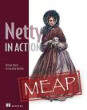

# Essential Netty in Action 《Netty 实战(精髓)》

It is a book about the Essentials of Norman Maurer's [Netty in Action](http://manning.com/maurer/)(base on MEAP v10). Through this book, you can quickly start with Netty. This is a GitBook version of the book: <http://waylau.gitbooks.io/essential-netty-in-action/>
Let's [READ](SUMMARY.md)!

《Netty 实战(精髓)》是对 Norman Maurer 的 《[Netty in Action](http://manning.com/maurer/)》(基于 MEAP v10)的一个中文精简。取其精华，去其糟粕，带你快速掌握 Netty ，插入配图，图文并茂方便用户理解。本书利用业余时间编写,由于时间紧凑,精力和能力有限,书中未免有纰漏和错误,望读者能够热忱斧正。

对于初学者，也推荐参阅《[Netty 4.x 用户指南](https://github.com/waylau/netty-4-user-guide)》。与之类似的 NIO 框架还有 MINA, 可参阅《[Apache MINA 2 用户指南](https://github.com/waylau/apache-mina-2.x-user-guide)》

